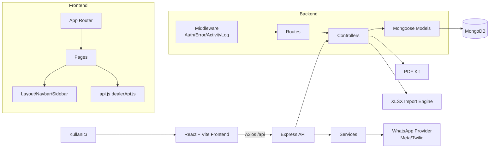

# Geliştirici Rehberi

Bu doküman yeni geliştiricilerin projeyi hızlıca devralması için hazırlanmıştır.

## 1) Kullanılan Teknolojiler

### Backend

- Node.js
- Express 5
- MongoDB + Mongoose
- JWT (jsonwebtoken)
- bcryptjs
- pdfkit
- xlsx

### Frontend

- React
- React Router
- Vite
- Axios
- xlsx

### Test / Araçlar

- Node test runner (node --test)
- Oxlint
- concurrently

## 2) Frontend Mimarisi

- Router merkezi: frontend/src/App.jsx
- Sayfalar: frontend/src/pages
- Ortak layout: frontend/src/components/Layout.jsx
- Navigasyon: frontend/src/components/Navbar.jsx, frontend/src/components/Sidebar.jsx
- API istemcileri:
  - frontend/src/services/api.js
  - frontend/src/services/dealerApi.js
- Tema sistemi: frontend/src/index.css + body data-theme

## 3) Backend Mimarisi

- Giriş: backend/server.js
- Katmanlar:
  - routes: HTTP sözleşmeleri
  - controllers: iş akışları
  - models: veri modeli
  - middleware: auth, activity log, error handler
  - services: harici sağlayıcı entegrasyonları
  - utils: ortak yardımcılar
- Veritabanı bağlantısı: backend/config/db.js

## 4) Kod Standartları

- Dosya ve modül adlarında tutarlılık:
  - route/controller/model isimleri uyumlu olmalı
- Çok kiracılı veri izolasyonu:
  - sorgularda company/companyId filtresi zorunlu
- Hata yönetimi:
  - controller içinde try/catch ve anlamlı HTTP kodları
- Yanıt standardı:
  - success, message, data/summary yapısı korunmalı
- Frontend:
  - kullanıcı metinleri Türkçe ve tutarlı olmalı
  - API çağrıları services katmanından geçmeli
- Test:
  - kritik endpoint değişikliklerinde integration test güncellenmeli

## 5) Çalıştırma Komutları

- Tüm sistem dev:
  - npm run dev
- Backend start:
  - npm run start --prefix backend
- Backend test:
  - npm run test:all --prefix backend
- Frontend dev:
  - npm run dev --prefix frontend
- Frontend build:
  - npm run build --prefix frontend

## 6) Ortam Değişkenleri

Backend:

- PORT
- MONGO_URI
- JWT_SECRET
- DEALER_PORTAL_BASE_URL
- PUBLIC_API_BASE_URL
- WHATSAPP_PROVIDER
- WHATSAPP_DEFAULT_COUNTRY_CODE
- WHATSAPP_META_TOKEN
- WHATSAPP_META_PHONE_NUMBER_ID
- TWILIO_ACCOUNT_SID
- TWILIO_AUTH_TOKEN
- TWILIO_WHATSAPP_FROM

Frontend:

- VITE_API_URL

## 7) Mimari Diyagram

## 8) Geliştirici Notları

- backend/routes/accountingRoutes.js ve backend/routes/storeProductRoutes.js dosyaları şu an mount edilmiyor.
- Invoice.js ve lnvoice.js isim çakışması teknik borç olarak izlenmeli.
- Import müşteri upsert akışında dealerPortalToken unique indeksine dikkat edilmeli.
